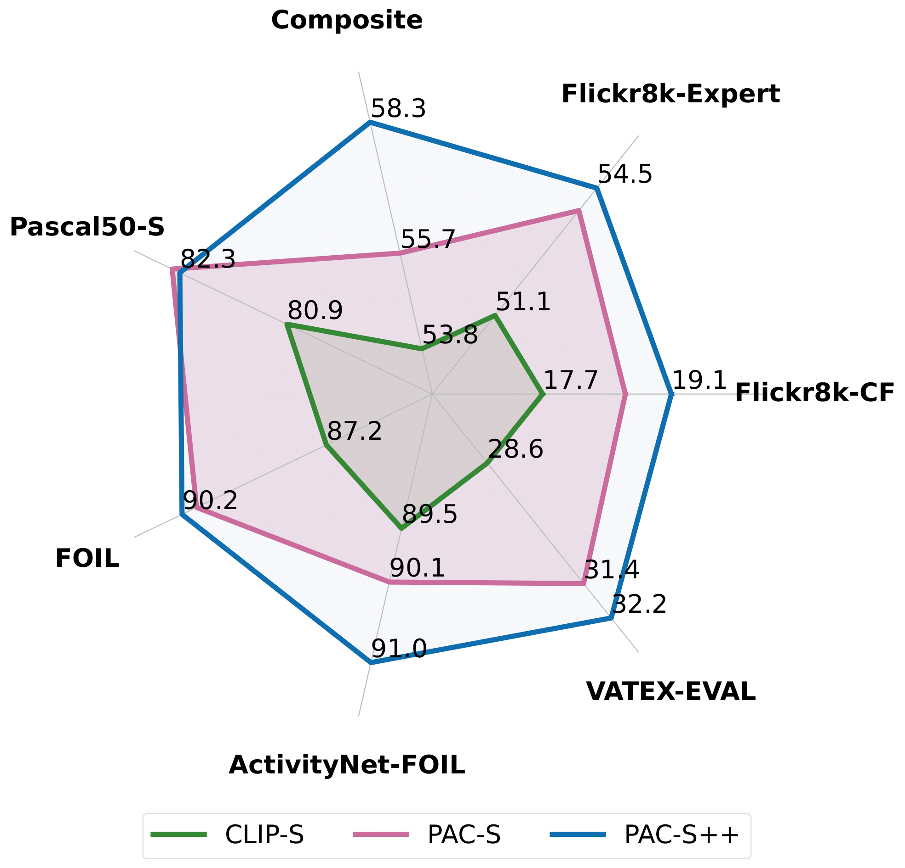

<div align="center">
  <h1>PAC-Score: Positive-Augmented Contrastive Learning for Image and Video Captioning Evaluation</br>(CVPR 2023 & IJCV 2025)</h1>


<a href="https://pytorch.org/get-started/locally/"></a>
[-f9f107.svg)](https://openaccess.thecvf.com/content/CVPR2023/html/Sarto_Positive-Augmented_Contrastive_Learning_for_Image_and_Video_Captioning_Evaluation_CVPR_2023_paper.html)
[](https://arxiv.org/abs/2303.12112)
  
</div>

This repository contains the reference code for the main paper and its extension:
* [Positive-Augmented Contrastive Learning for Image and Video Captioning Evaluation](https://arxiv.org/abs/2303.12112), **CVPR 2023 Highlight✨** (top 2.5% of initial submissions and top 10% of accepted papers). 
* [Positive-Augmented Contrastive Learning for Vision-and-Language Evaluation and Training](https://arxiv.org/abs/2410.07336), **IJCV 2025**. 

Please cite with the following BibTeX:
```
@inproceedings{sarto2023positive,
  title={{Positive-Augmented Contrastive Learning for Image and Video Captioning Evaluation}},
  author={Sarto, Sara and Barraco, Manuele and Cornia, Marcella and Baraldi, Lorenzo and Cucchiara, Rita},
  booktitle={Proceedings of the IEEE/CVF Conference on Computer Vision and Pattern Recognition},
  year={2023}
}
```
```
@inproceedings{sarto2024positive,
  title={{Positive-Augmented Contrastive Learning for Vision-and-Language Evaluation and Training}},
  author={Sarto, Sara and Nicholas, Moratelli and Cornia, Marcella and Baraldi, Lorenzo and Cucchiara, Rita},
  booktitle={arxiv},
  year={2024}
}
```

<p align="center">
  
</p> 

Try out the [Web demo](https://ailb-web.ing.unimore.it/pacscore), using [Gradio](https://github.com/gradio-app/gradio). 

## Environment Setup
Clone the repository and create the ```pacs``` conda environment using the ```environment.yml``` file:


```
conda env create -f environment.yml
conda activate pacs
```

## Loading CLIP Models

Checkpoints of different backbones are available at [this link](https://drive.google.com/drive/folders/15Da_nh7CYv8xfryIdETG6dPFSqcBiqpd?usp=sharing).

Once you have downloaded the checkpoints, place them under the ```checkpoints/``` folder.

<table style="border-collapse: collapse; width: auto; border: none;">
  <tr>
    <td style="padding: 0; border: none;">
      <table style="border-collapse: collapse; width: auto; border: none;">
        <tr>
          <td rowspan="2" style="border: none;"><b>PAC-S</b></td>
          <td style="border: none;"><b>CLIP ViT-B/32</b></td>
          <td style="border: none;">
            <a href="https://drive.google.com/file/d/1F-0Pma-vfJPAiDzeyl-iEdSXZIO1cDae/view?usp=drive_link" target="_blank">clip_ViT-B-32.pth</a>
          </td>
        </tr>
        <tr>
          <td style="border: none;"><b>OpenCLIP ViT-L/14</b></td>
          <td style="border: none;">  
          <a href="https://drive.google.com/file/d/1F-0Pma-vfJPAiDzeyl-iEdSXZIO1cDae/view?usp=drive_link" target="_blank">openClip_ViT-L-14.pth</a>
          </td>
        </tr>
        <tr>
          <td rowspan="2" style="border: none;"><b>PAC-S++</b></td>
          <td style="border: none;"><b>CLIP ViT-B/32</b></td>
          <td style="border: none;">
            <a href="https://ailb-web.ing.unimore.it/publicfiles/pac++/PAC++_clip_ViT-B-32.pth" target="_blank">PAC++_clip_ViT-B-32.pth</a>
          </td>
        </tr>
        <tr>
          <td style="border: none;"><b>CLIP ViT-L/14</b></td>
          <td style="border: none;">
            <a href="https://ailb-web.ing.unimore.it/publicfiles/pac++/PAC++_clip_ViT-L-14.pth" target="_blank">PAC++_clip_ViT-L-14.pth</a>
          </td>
        </tr>
      </table>
    </td>
    <td style="padding: 0; border: none;">
      
    </td>
  </tr>
</table>


## Data Preparation

An example set of inputs, including a candidate json, image directory, and references json is provided in this repository under ```example/```. The input files are formatted as follows.

The candidates json should be a dictionary that maps from {"image_identifier": "candidate_captions"}:
```
{"image1": "A white dog is laying on the ground with its head on its paws .",
  ...}
```
The image directory should be a directory containing the images that act as the keys in the candidates json:
```
images/
├── image1.jpg
└── image2.jpg
```
The references json should be a dictionary that maps from {"image_identifier": ["list", "of", "references"]}:
```
{"image1":
    [
        "A closeup of a white dog that is laying its head on its paws .",
        "a large white dog lying on the floor .", 
        "A white dog has its head on the ground .",
        "A white dog is resting its head on a tiled floor with its eyes open .",
        "A white dog rests its head on the patio bricks ."
    ]}
```

## Compute PAC-S

Run ```python -u compute_metrics.py``` to obtain standard captioning metrics (_e.g._ BLEU, METEOR, etc.) and PAC-S.

To compute RefPAC-S run ```python -u compute_metrics.py --compute_refpac```.

The default backbone used is the CLIP ViT-B-32 model. To use a different backcbone (_e.g._ OpenCLIP ViT-L/14 backbone) specify in the command input ```--clip_model open_clip_ViT-L/14```. 

To try the enhanced version, PAC++, you can follow these instructions. 

```
BLEU-1: 0.6400
BLEU-4: 0.3503
METEOR: 0.3057
ROUGE: 0.5012
CIDER: 1.4918
PAC-S: 0.8264
RefPAC-S: 0.8393
```
Worse captions should get lower scores:

``` 
python -u compute_metrics.py --candidates_json example/bad_captions.json --compute_refpac  

BLEU-1: 0.4500
BLEU-4: 0.0000
METEOR: 0.0995
ROUGE: 0.3268
CIDER: 0.4259
PAC-S: 0.5772
RefPAC-S: 0.6357

```
## Human Correlation Scores

#### Flickr8k

The Flickr8k dataset can be downloaded at [this link](https://drive.google.com/drive/folders/1oQY8zVCmf0ZGUfsJQ_OnqP2_kw1jGIXp?usp=sharing).

Once you have downloaded the dataset, place them under the ```datasets/flickr8k``` folder.


#### Run Code and Expected Output

Run ```python -u compute_correlations.py``` to compute correlation scores on **Flickr8k-Expert** and **Flickr8k-CF** datasets.


``` 
Computing correlation scores on dataset: flickr8k_expert
BLEU-1   Kendall Tau-b: 32.175    Kendall Tau-c: 32.324
BLEU-4   Kendall Tau-b: 30.599    Kendall Tau-c: 30.776
METEOR   Kendall Tau-b: 41.538    Kendall Tau-c: 41.822
ROUGE    Kendall Tau-b: 32.139    Kendall Tau-c: 32.314
CIDER    Kendall Tau-b: 43.602    Kendall Tau-c: 43.891
PAC-S    Kendall Tau-b: 53.919    Kendall Tau-c: 54.292

Computing correlation scores on dataset: flickr8k_cf
BLEU-1   Kendall Tau-b: 17.946    Kendall Tau-c: 9.256
BLEU-4   Kendall Tau-b: 16.863    Kendall Tau-c: 8.710
METEOR   Kendall Tau-b: 22.269    Kendall Tau-c: 11.510
ROUGE    Kendall Tau-b: 19.903    Kendall Tau-c: 10.274
CIDER    Kendall Tau-b: 24.619    Kendall Tau-c: 12.724
PAC-S    Kendall Tau-b: 36.037    Kendall Tau-c: 18.628
```

For the reference based version of the PACScore, add ```--compute_refpac```.

## Compute PAC-S++

Run ```python -u compute_correlations_pac++.py``` to compute correlation scores on **Flickr8k-Expert** and **Flickr8k-CF** datasets. 

For the reference based version of the PACScore++, add ```--compute_refpac```.


